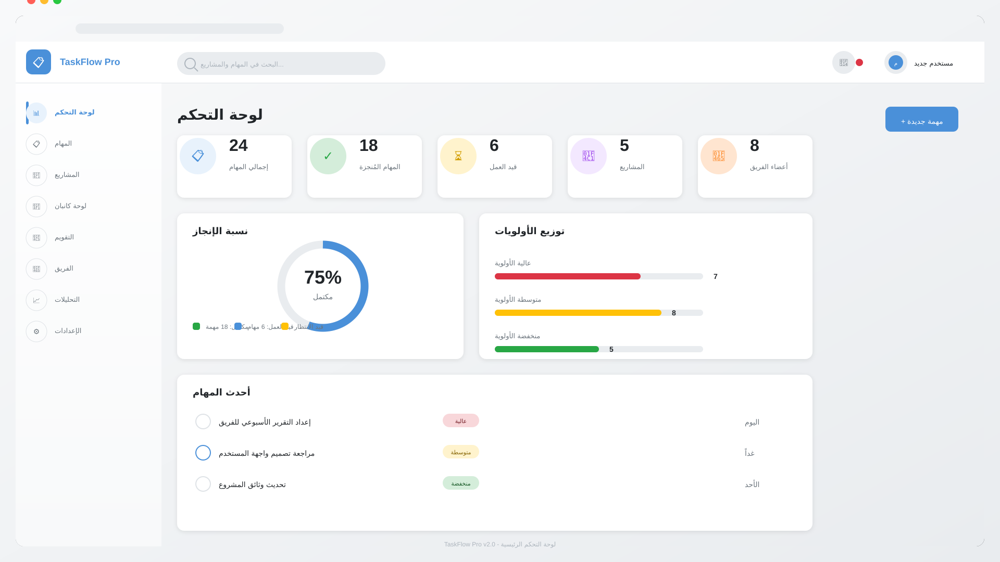
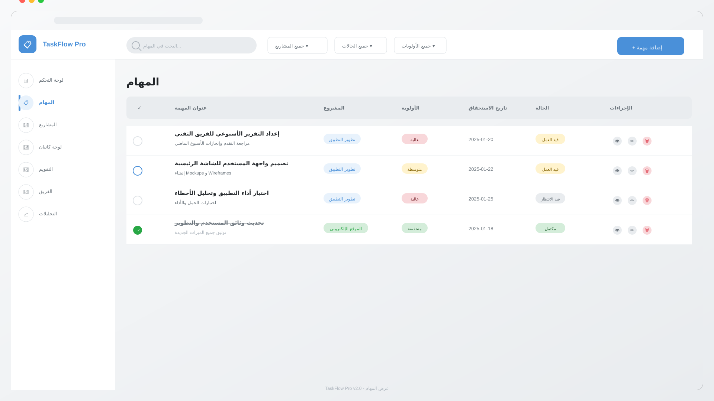
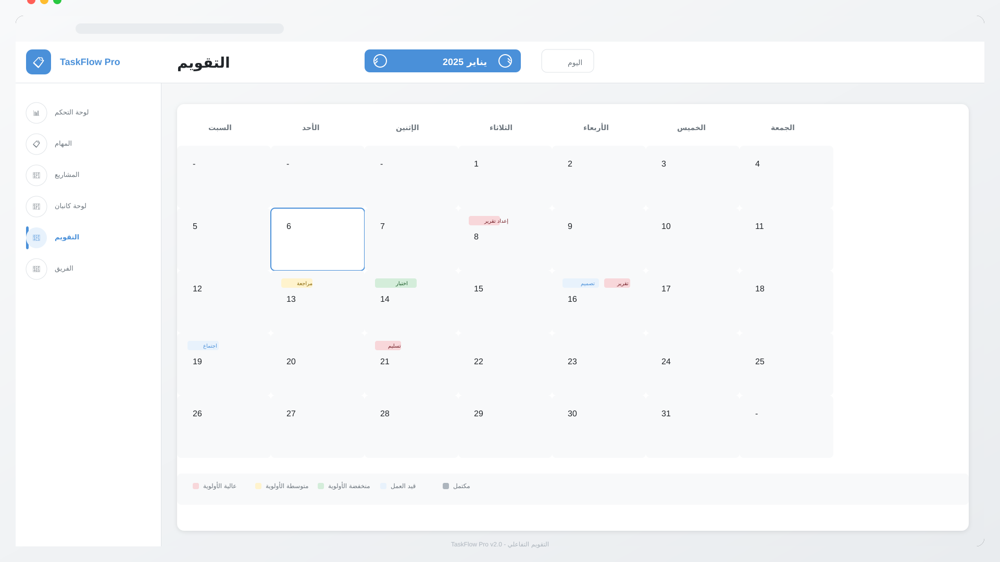
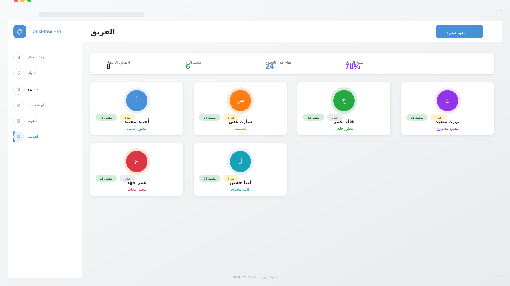
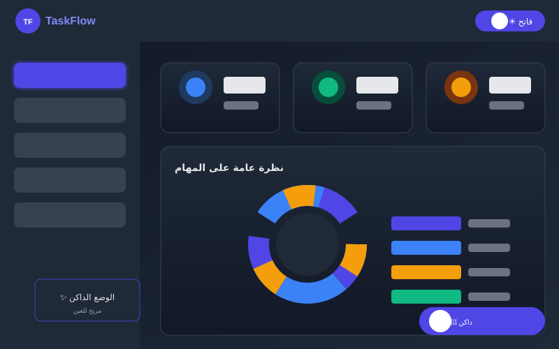
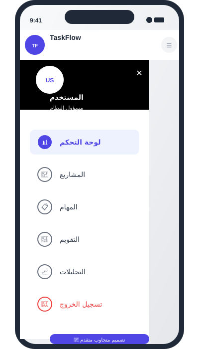

# 🚀 TaskFlow Pro v2.0

<div align="center">


**منصة إدارة المشاريع الاحترافية - مبنية بـ Vanilla JavaScript**

*بناء مشاريعك بذكاء - بدون إطار عمل، بدون تعقيد*

[](https://developer.mozilla.org/en-US/docs/Web/HTML)
[](https://developer.mozilla.org/en-US/docs/Web/CSS)
[](https://developer.mozilla.org/en-US/docs/Web/JavaScript)
[](LICENSE)

*دعم كامل للغة العربية مع تصميم RTL*

</div>

---

## 📖 نظرة عامة على المشروع

### ما هو TaskFlow Pro؟

**TaskFlow Pro** هو تطبيق ويب احترافي لإدارة المشاريع والمهام، تم بناؤه بالكامل باستخدام تقنيات الويب الأساسية (Vanilla HTML, CSS, JavaScript) دون الاعتماد على أي إطار عمل خارجي. يهدف التطبيق إلى توفير تجربة إدارة مشاريع سلسة وفعالة للفرق والأفراد الناطقين باللغة العربية.

### فلسفة المشروع

- ✅ **بدون إطار عمل** - 100% Vanilla JavaScript
- ✅ **سريع وخفيف** - لا تحميل لمكتبة ضخمة
- ✅ **سهل الفهم** - كود نظيف وموثق
- ✅ **RTL مدمج** - دعم كامل للغة العربية
- ✅ **محلي بالكامل** - بياناتك تبقى على جهازك

---

## ✨ المميزات الرئيسية

### 🎯 لوحة التحكم (Dashboard)
نظرة شاملة على جميع مشاريعك ومهامك مع إحصائيات تفصيلية ورسوم بيانية.

### 📋 نظام كانبان (Kanban Board)
نظام سحب وإفلات بديهي لإدارة سير العمل عبر ثلاثة أعمدة: قيد الانتظار، قيد العمل، مكتمل.

### 📅 التقويم الذكي
عرض تقويمي للمواعيد النهائية مع إمكانية التنقل بين الأشهر.

### 👥 إدارة الفريق
إضافة أعضاء للفريق ومتابعة إنتاجيتهم وتصنيفهم.

### 📈 التحليلات والتقارير
رسوم بيانية تفاعلية لتوزيع المهام ومعدل الإنجاز.

### ⚙️ إعدادات شاملة
تخصيص الثيم والوضع الداكن والإشعارات واللغة.

---

## 🖼️ لقطات الشاشة

### 1. لوحة التحكم الرئيسية


*عرض شامل للإحصائيات والمشاريع الأخيرة*

### 2. إدارة المهام


*قائمة المهام مع الفلاتر والخيارات المتقدمة*

### 3. لوحة كانبان


*نظام إدارة المهام بالسحب والإفلات*

### 4. التقويم


*عرض شهري للمواعيد والمهام*

### 5. إدارة الفريق


*أعضاء الفريق وإحصائياتهم*

### 6. التحليلات


*رسوم بيانية تفاعلية*

### 7. الوضع الداكن


*دعم كامل للثيم الداكن*

### 8. التوافق مع الجوال


*تصميم متجاوب يعمل على جميع الأجهزة*

---

## 🎬 فيديو تعريفي

### وصف الفيديو

```
المدة: 60 ثانية
اللغة: عربي
القرار: 1080p
```

### مشاهد الفيديو

| المدة | المشهد | الوصف |
|-------|--------|-------|
| 0:00-0:05 | مقدمة | شعار TaskFlow Pro + عنوان |
| 0:05-0:15 | جولة لوحة التحكم | عرض الإحصائيات والأنشطة |
| 0:15-0:25 | عرض كانبان | سحب وإفلات المهام |
| 0:25-0:35 | إضافة مهمة | فتح النموذج وملؤه |
| 0:35-0:45 | التقويم | عرض المواعيد والمهام |
| 0:45-0:55 | الفريق | عرض أعضاء الفريق |
| 0:55-1:00 | خاتمة | "مبني بـ Vanilla JavaScript" |

### فيديو الإنتاج
تفاصيل إنتاج الفيديو متاحة في: [docs/video-production.md](docs/video-production.md)

---

## 🚀 بدء الاستخدام

### الطريقة 1: فتح الملف مباشرة

```bash
cd taskflow-pro
# افتح index.html في المتصفح
```

### الطريقة 2: باستخدام خادم محلي

```bash
# باستخدام Python
python -m http.server 8000

# أو باستخدام Node.js
npx serve taskflow-pro
```

---

## 📁 هيكل المشروع

```
taskflow-pro/
│
├── 📄 index.html                 # الصفحة الرئيسية للتطبيق
├── 📄 styles.css                 # جميع تنسيقات CSS
├── 📄 script.js                  # منطق التطبيق والتفاعلات
├── 📄 README.md                  # هذا الملف
├── 📄 LICENSE                    # رخصة MIT
│
├── 📁 assets/
│   ├── 📁 images/
│   │   └── logo.svg              # شعار التطبيق
│   │   └── video-thumbnail.svg   # صورة الفيديو المصغرة
│   │
│   └── 📁 screenshots/
│       ├── dashboard-preview.svg
│       ├── tasks-preview.svg
│       ├── kanban-preview.svg
│       ├── calendar-preview.svg
│       ├── team-preview.svg
│       ├── analytics-preview.svg
│       ├── dark-mode-preview.svg
│       └── mobile-preview.svg
│
└── 📁 docs/
    └── video-production.md       # تفاصيل إنتاج الفيديو
```

---

## 🤝 المساهمة في المشروع

نرحب بمساهماتكم! للمشاركة:

```bash
# 1. Fork المشروع
# 2. إنشاء فرع جديد
git checkout -b feature/amazing-feature

# 3. إجراء التغييرات وCommit
git commit -m 'إضافة ميزة رائعة'

# 4. Push وفتح Pull Request
```

---

## ❓ الأسئلة الشائعة

**س: هل التطبيق يحتاج اتصال بالإنترنت؟**
ج: لا، يعمل محلياً. تحتاج الإنترنت فقط لتحميل الخطوط والأيقونات.

**س: هل بياناتي آمنة؟**
ج: نعم، تُخزن محلياً في LocalStorage.

**س: هل يدعم اللغة الإنجليزية؟**
ج: حالياً عربي فقط، الإنجليزية قادمة قريباً.

---

## 📄 الرخصة

هذا المشروع مرخص تحت رخصة MIT - انظر ملف [LICENSE](LICENSE) للتفاصيل.

---

## 📞 تواصل معنا

<div align="center">

[](https://github.com/MiniMax-Agent/taskflow-pro)
[](mailto:support@minimax.dev)

---

**صُنع بـ ❤️ باستخدام Vanilla JavaScript**

*TaskFlow Pro - إدارة مشاريعك بذكاء*

</div>

---

<div align="left">

*آخر تحديث: 15 يناير 2025*
*الإصدار: 2.0.0*
*اللغة: العربية (RTL) + الإنجليزية*

</div>
